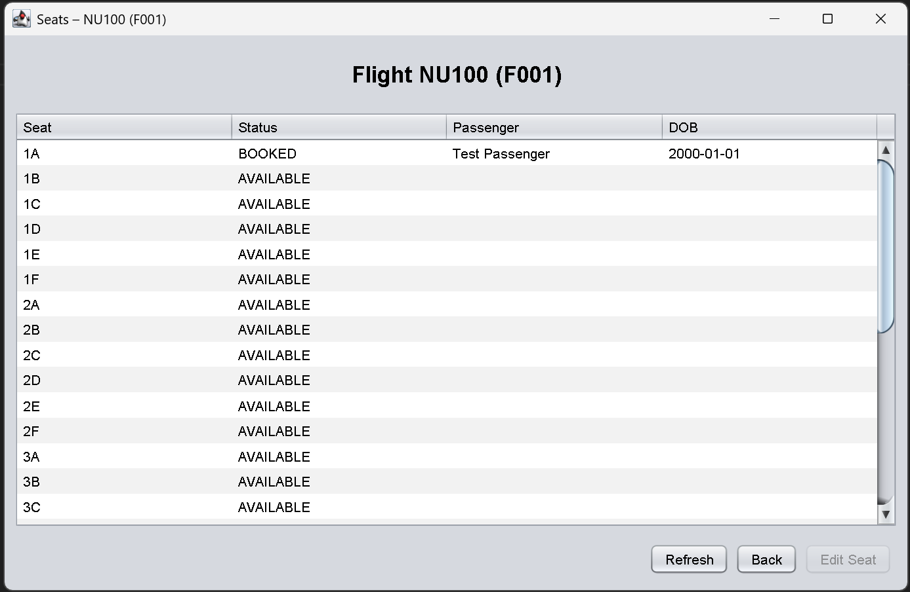
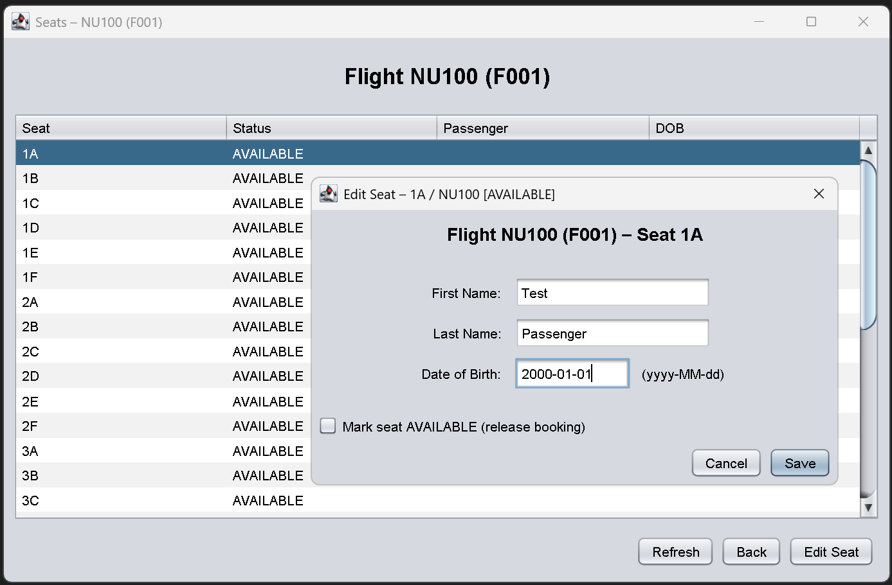

# 📘 National University Airlines Scheduler
*A Java Swing application for managing flight seat reservations.*

---

## ✈️ Project Overview
**National University Airlines** is a lightweight desktop tool written in Java that allows airline schedulers to view flights, manage seat availability, and record passenger information — all stored locally in a flat file (`database.txt`).  
Unlike commercial scheduling systems, this app is **free**, **offline**, and does **not** rely on cloud databases.

---

## 🖼️ Application Preview


*Figure: Current Home Screen interface showing available flights.*

### 💺 Seats Screen


*Shows seats for a selected flight, with seat status and passenger info.*

### 👤 Seat Editor


*Allows editing of passenger details with validation and autosave.*

---

## 👥 Team 2 – CSC449 Software Engineering
Developed collaboratively as part of a group assignment to demonstrate modular design, version control, and sprint-based development.

---

## 🎯 Current Sprint Status
| Issue | Description | Status |
|--------|--------------|---------|
| #1 | App entry point | ✅ In Review |
| #2 | Flight model | ✅ In Review |
| #3 | Seat & Passenger models | ✅ In Review |
| #4 | File storage (read CSV / autoload) | ✅ In Review |
| #5 | File storage (write CSV / autosave) | ✅ In Review |
| #6 | DatabaseService (backend controller) | ✅ In Review |
| #7 | HomeFrame UI (flight listing screen) | ✅ In Review |
| #8 | SeatsFrame | ✅ In Review |
| #9 | SeatEditorDialog | ✅ In Review |
| #10 | Autoload on app launch | ✅ In Review |
| #11 | Validation | 🚧 Next |
| #12 | Menu: File -> Exit | 🚧 Planned |
| #13 | Sample database.txt in repo | 🚧 Planned |

---

## 🚀 Quick Setup Guide

### 🔧 1. Install Java
This project runs on modern Java.

- Recommended: **JDK 21 or later**

### 📥 2. Retrieve the Repository
Clone the repository from GitHub:
```bash
git clone https://github.com/Mark-Langston/National_University_Airlines.git
cd National_University_Airlines/src

---

## 🧩 Architecture Overview
The project follows a **modular, layered design**:

